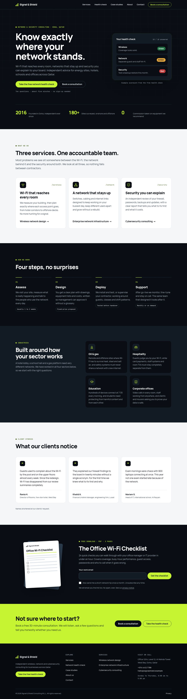

# Signal & Shield Consulting: WordPress website

A complete WordPress site for **Signal & Shield Consulting**, a fictional wireless, network and cybersecurity consultancy in Doha, Qatar. It is written for business owners, IT managers and facility managers rather than engineers.



## What is in this repository

| Path | What it is |
| --- | --- |
| `wp-content/themes/signal-shield/` | Custom block theme, "Night Ops" design: theme.json tokens, templates, header/footer, and one pattern per page section. |
| `wp-content/plugins/signal-shield-core/` | Companion plugin: network health check quiz, contact form, Office Wi-Fi Checklist download, and the admin screens for enquiries and downloads. |
| `wp-content/mu-plugins/ss-dev-mail.php` | **Development only.** Sends all site email to Mailpit. Do not deploy it. |
| `docker-compose.yml`, `bin/setup.sh` | Local stack: WordPress 7.1 (PHP 8.3), MariaDB 11, Mailpit and WP-CLI. |
| `resources/checklist/` | HTML source of the checklist PDF. `bin/build-checklist.js` rebuilds it. |
| `docs/screenshots/` | Screenshots of the finished site. |

## Run it locally

You need Docker with Compose.

```bash
docker compose up -d            # WordPress, database and Mailpit
docker compose run --rm setup   # first run only: installs WordPress and creates the pages
```

- Site: http://localhost:8080
- Admin: http://localhost:8080/wp-admin (user `admin`, password `admin`)
- Mailpit, which catches every email the site sends: http://localhost:8025

Other ports: `WP_PORT=8081 MAILPIT_PORT=8026 docker compose up -d`. To log PHP notices, start with `WP_DEBUG=1`.

To start over: `docker compose down -v`, then repeat the two commands above.

## Pages

| Page | URL | Highlights |
| --- | --- | --- |
| Home | `/` | Hero with both calls to action, three services, How we work (Assess, Design, Deploy, Support), four industries, three testimonials, checklist offer, consultation banner. |
| Services | `/services/` | One section per service: what it is, problems it solves, what you receive, typical duration. |
| Network Health Check | `/network-health-check/` | 10-question quiz, one question per screen with a progress bar, then a Green / Amber / Red scorecard with a tip per area. |
| Case Studies | `/case-studies/` | Offshore platform Wi-Fi, hotel guest network, office firewall overhaul. Each has Challenge, Solution, Result and headline numbers. |
| About | `/about/` | Story, values, placeholder certification badges, team of four with placeholder photos. |
| Contact | `/contact/` | Validated form, WhatsApp button, phone, email, address, and Sunday to Thursday hours. |
| Privacy | `/privacy/` | Plain-language privacy notice covering the two forms. |

## How the features work

### Network health check
- There are 10 questions across three areas: Wireless (3), Network (3) and Security (4). Each answer scores 2, 1 or 0. "Not sure" scores 0, because not knowing is a risk in itself.
- Each area is rated **Green** at 75% of its points or more, **Amber** from 40%, and **Red** below that.
- The tip for an area depends on its rating. A Green area gets a "keep it up" tip. Any other area gets the tip for its lowest-scoring answer.
- Each rating has its own icon as well as its colour, so it can be read without colour vision.
- Answers are scored in the browser and never stored.
- **Book a free consultation** opens the contact form with the service set to "Follow-up on my health check" and the results written into the message.
- **Retake the quiz** clears every answer and starts again.
- Without JavaScript, all ten questions appear on one page and the server works out the scorecard.

### Contact form
- **Required fields:** name, email, service and message. Company and phone are optional.
- **Phone check:** 7 to 15 digits, with an optional `+`, spaces, dashes and brackets.
- **Validation:** fields are checked when you leave them and again on submit. Errors appear next to each field, and a summary at the top links to each problem and takes focus. The server applies the same rules.
- **Storage:** every message is saved under **Enquiries** in wp-admin and emailed to the notification address, with Reply-To set to the sender. Change the address under **Settings › General › Enquiry notifications**; it defaults to the admin email.
- **Spam protection:** a hidden honeypot field, a minimum fill time, and a limit of 5 successful messages per visitor every 10 minutes. No CAPTCHA.

### Office Wi-Fi Checklist
- **What it is:** a 3-page branded PDF with 24 checks.
- **How visitors get it:** they enter an email address, with an optional box for monthly tips. They get a personal download link straight away and also by email. The link works for 7 days.
- **Admin record:** requests appear under **Enquiries › Checklist downloads**, with a download count.
- **File protection:** the PDF sits in `signal-shield-core/downloads/`, and an `.htaccess` file makes Apache refuse direct access. On **nginx**, add an equivalent `deny` rule for that folder.
- **Editing it:** change `resources/checklist/office-wifi-checklist.html`, then run `npm install playwright && node bin/build-checklist.js`.

## Editing content

- Each page holds a reference to a pattern, so it renders straight away.
- **Editing a page:** opening it in the editor turns the pattern into normal blocks you can change. Save, and the page keeps your edits.
- **Resetting pages:** `docker compose run --rm wpcli signal-shield setup --force` puts every page back to the theme's original content.
- **Reusing sections:** individual sections (hero, services, CTA banner and so on) are in the block inserter under **Patterns › Signal & Shield**.
- **Navigation:** the header menu is built from the theme pattern `patterns/header.php`.

## Design

**Direction C, "Night Ops"**, chosen from three options:
- **Base:** a midnight background (`#0A0E14`), with cloud-white reading sections.
- **Accent:** electric lime (`#C6F432`), used only for actions, focus states and data marks.
- **Fonts:** **Manrope** for all text and **JetBrains Mono** for small technical labels. Both are self-hosted, and their licences are in `assets/fonts/LICENSE.md`.
- **Colour tokens:** live in `theme.json`. `assets/css/theme.css` swaps button, link, focus and form colours automatically between dark and light sections, so contrast holds in both.

## Accessibility and testing

These were checked on a clean install:

- **Accessibility audit:** axe-core (WCAG 2.1 AA plus best practice) found no violations on any page at 1280px and 390px. The same was true for the quiz error state, the scorecard, the contact form errors and the open mobile menu.
- **Browser tests:** 22 Playwright checks pass (`tests/e2e.js`). They cover the quiz (keyboard use, validation, back, scoring, the consultation link, retake), the contact form (empty submit, invalid values, live clearing of errors, success), the checklist (invalid email, success, the PDF download, a bad token, blocked direct access), the current-page marker in navigation, the skip link, and the mobile menu at 390px and 800px (opens full screen, closes with Escape).
- **Editor:** every block on all 7 pages opens in the block editor with no "invalid content" warnings.
- **No-JavaScript fallbacks:** contact, checklist and quiz all work without JavaScript.
- **Layout:** no horizontal scrolling at 360, 390, 640, 800, 1024 or 1440px.

The keyboard features in the site: a skip link, visible lime focus rings, a full-screen mobile menu below 1024px, focus moved to each new quiz question and to results, and `prefers-reduced-motion` respected.

## Before going live

1. Replace the placeholder details:
   - phone `+974 4412 7788`
   - WhatsApp `+974 5512 7788`
   - email `hello@signalshield.example`
   - office address

   They appear in `patterns/footer.php`, `patterns/page-contact.php`, the plugin's messages and the checklist source.
2. Replace the team photos and certification badges in `assets/images/` with real ones, and update the alt text in `patterns/page-about.php`.
3. Check that the testimonials, case-study figures and the "since 2016 / 180+ sites" claims are true for the real business.
4. Install an SMTP plugin, or configure your host's mail, so notification emails are delivered reliably. Enquiries are saved in wp-admin either way.
5. Deploy only the theme and plugin folders. Leave out `mu-plugins/ss-dev-mail.php`.
6. If the site sits behind a proxy or CDN, the rate limit sees the proxy's IP address. Adjust it with the `ss_core_rate_limit` filter, or put real client IPs in `REMOTE_ADDR`.
7. Have the privacy notice reviewed against Qatar's Law No. 13 of 2016 for your actual data handling.
